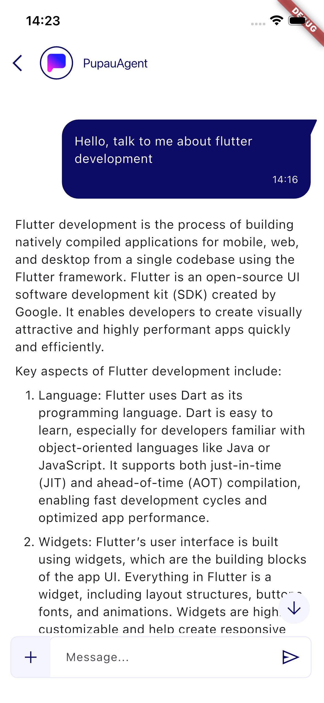
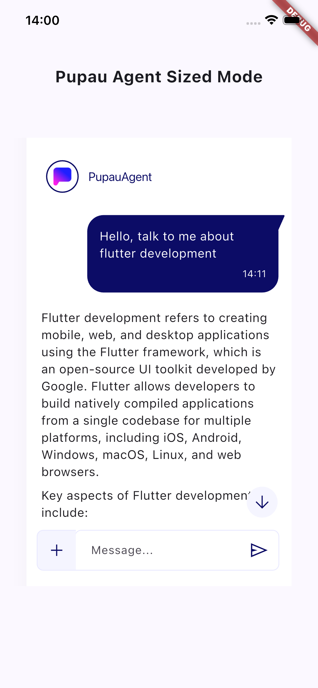
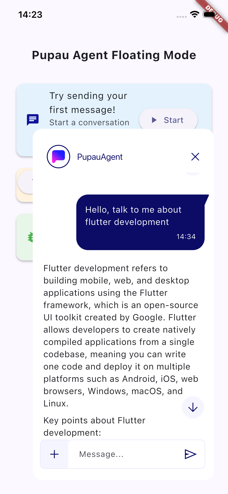

# Flutter Agent Pupau

A Flutter plugin that integrates Pupau AI agents in your application.

## Features

- **AI-Powered Chat Interface** - Full-featured chat UI with streaming responses
- **Multiple Widget Modes** - Full screen, sized container, or floating overlay
- **Flexible Authentication** - API key or bearer token authentication
- **Event Streaming** - Real-time events for conversation lifecycle
- **Multi-language Support** - Built-in support for 14 languages
- **Programmatic Control** - Open, reset, and load conversations via code

## Documentation

For full documentation on Pupau and more information on this plugin, visit
[Pupau AI Docs](https://docs.pupau.ai/docs/guides/integrations/flutter_plugin)

## Installation

Add the package name and version in your package's `pubspec.yaml` file:

```yaml
dependencies:
  flutter_agent_pupau: ^1.0.1
```

Then run:

```bash
flutter pub get
```

## Usage

### 1. Import the plugin

```dart
import 'package:flutter_agent_pupau/flutter_agent_pupau.dart';
```

### 2. Configure PupauConfig

Create a PupauConfig using one of two authentication methods:

#### Option A: API Key Authentication

```dart
final config = PupauConfig.createWithApiKey(
  apiKey: 'your-api-key',
  // Optional parameters
  conversationId: 'existing-conversation-id',  // Load specific conversation
  isAnonymous: false,                          // Anonymous chat mode
  language: 'en',                              // UI language (en, es, fr, de, etc.)
  googleMapsApiKey: 'your-maps-key',           // For location features
  hideInputBox: false,                         // Hide the input field
  widgetMode: WidgetMode.full,                 // Display mode
  showNerdStats: false,                        // Show token/credit stats
  hideAudioRecordingButton: false              // Hide Record Audio button
  conversationStarters: [                      // Predefined starter messages
    'Tell me about your features',
    'How can you help me?',
  ],
  customProperties: {                          // Custom metadata
    'userId': '123',
    'source': 'mobile_app',
  },
);
```

#### Option B: Bearer Token Authentication

Requires explicit assistant ID.

```dart
final config = PupauConfig.createWithToken(
  bearerToken: 'your-bearer-token',
  assistantId: 'your-assistant-id',
  isMarketplace: false,                        // Set to true if it's a Pupau marketplace agent
  // ... same optional parameters as above
);
```

## Widget Avatar

The `PupauAgentAvatar` widget is the main UI component that displays an avatar and handles chat interactions. It supports three display modes:

### Full Screen Mode (Default)

On tap it navigates to a full page that displays the chat.

```dart
PupauAgentAvatar(
  config: PupauConfig.createWithApiKey(
    apiKey: 'your-api-key',
    widgetMode: WidgetMode.full,
  ),
)
```



### Sized Mode

The avatar expands in-place to a specified width and height.

```dart
PupauAgentAvatar(
  config: PupauConfig.createWithApiKey(
    apiKey: 'your-api-key',
    widgetMode: WidgetMode.sized,
    sizedConfig: SizedConfig(
      width: 400,
      height: 600,
      initiallyExpanded: false, // Start collapsed
    ),
  ),
)
```

### Initially Expanded Chat

**If you want the chat to be already expanded when the widget first loads**, use the sized mode with `initiallyExpanded: true`. You can also specify to not show the close button, so that the chat will always stay open.

```dart
PupauAgentAvatar(
  config: PupauConfig.createWithApiKey(
    apiKey: 'your-api-key',
    widgetMode: WidgetMode.sized,
    sizedConfig: SizedConfig(
      width: 400,
      height: 600,
      initiallyExpanded: true, //Chat starts expanded!
      hasCloseButton: false //Hide close button so that expanded chat cannot be closed
    ),
  ),
)
```



### Floating Overlay Mode

The chat appears as a floating overlay anchored to the avatar.

```dart
PupauAgentAvatar(
  config: PupauConfig.createWithApiKey(
    apiKey: 'your-api-key',
    widgetMode: WidgetMode.floating,
    floatingConfig: FloatingConfig(
      width: 400,
      height: 600,
      anchor: FloatingAnchor.bottomRight, // bottomRight, bottomLeft, topRight, topLeft
    ),
  ),
)
```




## Programmatic Control with PupauChatUtils

Control the chat programmatically from anywhere in your app:

### Open Chat from Code

```dart
// Open chat with a button press
ElevatedButton(
  onPressed: () {
    PupauChatUtils.openChat(
      context,
      PupauConfig.createWithApiKey(apiKey: 'your-api-key'),
    );
  },
  child: Text('Open Chat'),
)
```

### Reset Current Chat

```dart
// Clear the current conversation and start fresh
await PupauChatUtils.resetChat();
```

### Load Specific Conversation

```dart
// Load a conversation by ID
await PupauChatUtils.loadConversation('conversation-id');
```


## Event Streaming with PupauEventService

Listen to real-time events from the chat interface:

### Basic Event Listening

```dart
import 'package:flutter_agent_pupau/flutter_agent_pupau.dart';

// Listen to all chat events
PupauEventService.pupauStream.listen((event) {
  print('Event Type: ${event.type}');
  print('Event Payload: ${event.payload}');
  
  switch (event.type) {
    case UpdateConversationType.newConversation:
      print('New conversation created: ${event.payload}');
      break;
    case UpdateConversationType.messageSent:
      print('Message sent: ${event.payload}');
      break;
    case UpdateConversationType.messageReceived:
      print('Message received: ${event.payload}');
      break;
    case UpdateConversationType.conversationChanged:
      print('Conversation changed to: ${event.payload}');
      break;
    case UpdateConversationType.error:
      print('Error occurred: ${event.payload}');
      break;
    // ... handle other events
  }
});
```

## Audio Recording Feature

To use the audio recording feature, follow these steps

### Android Audio Setup

In your `AndroidManifest.xml` file add:

```xml
<uses-permission android:name="android.permission.RECORD_AUDIO" />
```

### iOS Audio Setup

In your `ios/Runner/Info.plist` file add:

```xml
<key>NSMicrophoneUsageDescription</key>
<string>This app needs access to your microphone to record voice messages.</string>
```

Then in your `ios/Podfile`, in the `post_install` section, add the microphone permission configuration:

```ruby
post_install do |installer|
  installer.pods_project.targets.each do |target|
    flutter_additional_ios_build_settings(target)
    target.build_configurations.each do |config|
      config.build_settings['GCC_PREPROCESSOR_DEFINITIONS'] ||= [
        '$(inherited)',
        'PERMISSION_MICROPHONE=1',
      ]
    end
  end
end
```

**Note:** After modifying the Podfile, run `flutter clean` and rebuild your app, as these changes require recompilation.

### Event Types

| Event Type | Payload | Description |
|------------|---------|-------------|
| `componentBootStatus` | `BootState` | Plugin initialization status (off, pending, ok, error) |
| `newConversation` | `String` (conversationId) | New conversation created |
| `resetConversation` | `null` | Conversation was reset |
| `conversationChanged` | `String` (conversationId) | Active conversation changed |
| `conversationTitleGenerated` | `String` (title) | Conversation title generated |
| `firstMessageComplete` | `null` | First message in conversation completed |
| `messageSent` | `Message` | User sent a message |
| `messageReceived` | `Message` | AI response received |
| `stopMessage` | `null` | Message streaming stopped |
| `deleteConversation` | `String` (conversationId) | Conversation deleted |
| `windowClose` | `null` | Chat window closed |
| `historyToggle` | `bool` | Conversation history toggled |
| `noCredit` | `null` | No credits available |
| `error` | `String` (error message) | General error occurred |
| `authError` | `String` (error message) | Authentication error |
| `tokensPerSecond` | `double` | Streaming performance metric |
| `timeToComplete` | `int` (milliseconds) | Time to complete response |
| `timeToFirstToken` | `int` (milliseconds) | Time to first token received |


## Supported Languages

The plugin supports the following language codes for the `language` parameter:

- `en` - English (default)
- `de` - German
- `es` - Spanish
- `fr` - French
- `hi` - Hindi
- `it` - Italian
- `ko` - Korean
- `nl` - Dutch
- `pl` - Polish
- `pt` - Portuguese
- `sq` - Albanian
- `sv` - Swedish
- `tr` - Turkish
- `zh` - Chinese

## License

This project is licensed under the Apache License 2.0 - see the LICENSE file for details.