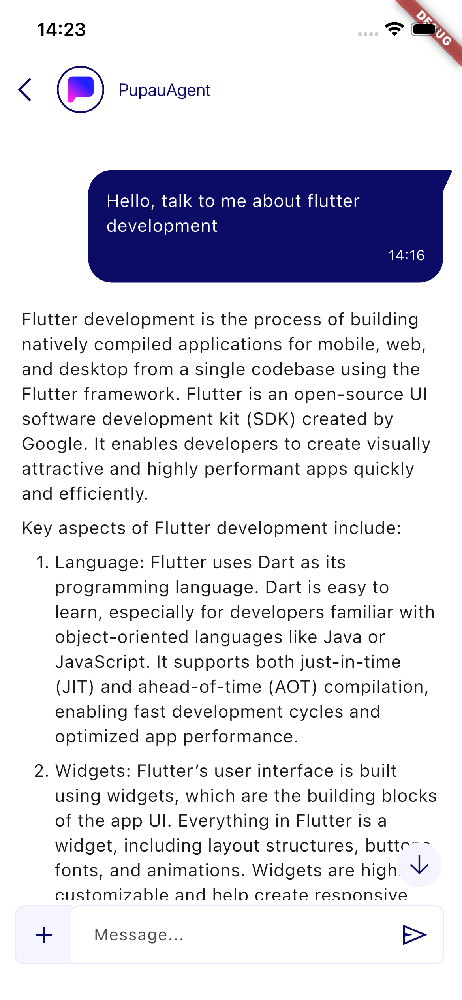
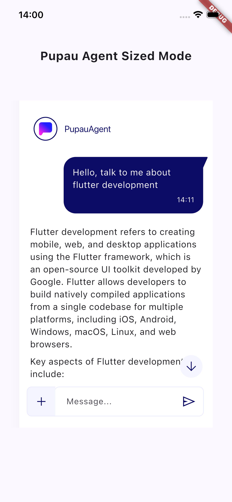
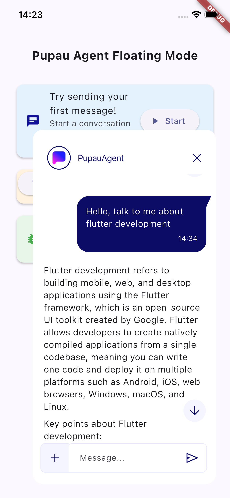

# Flutter Agent Pupau

A Flutter plugin that integrates Pupau AI agents in your application.

## Features

- **AI-Powered Chat Interface** - Full-featured chat UI with streaming responses
- **Multiple Widget Modes** - Full screen, sized container, or floating overlay
- **Flexible Authentication** - API key or bearer token authentication
- **Event Streaming** - Real-time events for conversation lifecycle
- **Multi-language Support** - Built-in support for 14 languages
- **Programmatic Control** - Open, reset, and load conversations via code

## Documentation

For full documentation on Pupau and more information on this plugin, visit
[Pupau AI Docs](https://docs.pupau.ai/docs/guides/integrations/flutter_plugin)

## Installation

Add the package name and version in your package's `pubspec.yaml` file:

```yaml
dependencies:
  flutter_agent_pupau: ^1.0.1
```

Then run:

```bash
flutter pub get
```

## Usage

### 1. Import the plugin

```dart
import 'package:flutter_agent_pupau/flutter_agent_pupau.dart';
```

### 2. Configure PupauConfig

Create a PupauConfig using one of two authentication methods:

#### Option A: API Key Authentication

```dart
final config = PupauConfig.createWithApiKey(
  apiKey: 'your-api-key',
  // Optional parameters
  conversationId: 'existing-conversation-id',  // Load specific conversation
  isAnonymous: false,                          // Anonymous chat mode
  language: PupauLanguage.en,                  // UI language (defaults to English)
  apiUrl: 'https://api.pupau.ai',              // Override base API URL
  isMarketplace: false,                        // Set true for marketplace agents
  googleMapsApiKey: 'your-maps-key',           // For location features
  hideInputBox: false,                         // Hide the input field
  widgetMode: WidgetMode.full,                 // Display mode
  showNerdStats: false,                        // Show token/credit stats
  hideAudioRecordingButton: false,             // Hide audio recording button
  resetChatOnOpen: true,                       // Reset chat state when opening
  conversationStarters: [                      // Predefined starter messages
    'Tell me about your features',
    'How can you help me?',
  ],
  initialWelcomeMessage: 'Hi! How can I help you today?', // Fallback welcome while actual message is loading
  customProperties: {                          // Custom metadata
    'userId': '123',
    'source': 'mobile_app',
  },
  appBarConfig: AppBarConfig(                 // App bar configuration
    showAppBar: true,
    actions: [],                               // Custom action buttons
    closeStyle: CloseStyle.arrow,            // arrow, cross, or none
    closeButtonPosition: CloseButtonPosition.left, // left or right
  ),
  drawerConfig: DrawerConfig(                 // Drawer configuration
    drawer: MyDrawer(),                       // Left drawer widget
    endDrawer: MyEndDrawer(),                 // Right drawer widget
    scaffoldKey: myScaffoldKey,              // Optional: GlobalKey<ScaffoldState> for programmatic control
    onDrawerChanged: (isOpen) {               // Called when drawer opens/closes
      print('Drawer is ${isOpen ? "open" : "closed"}');
    },
    onEndDrawerChanged: (isOpen) {             // Called when end drawer opens/closes
      print('End drawer is ${isOpen ? "open" : "closed"}');
    },
  ),
);
```

#### Option B: Bearer Token Authentication

Requires explicit assistant ID.

```dart
final config = PupauConfig.createWithToken(
  bearerToken: 'your-bearer-token',
  assistantId: 'your-assistant-id',
  // ... same optional parameters as above
);
```

## Widget Avatar

The `PupauAgentAvatar` widget is the main UI component that displays an avatar and handles chat interactions. It supports three display modes:

### Full Screen Mode (Default)

On tap it navigates to a full page that displays the chat.

```dart
PupauAgentAvatar(
  config: PupauConfig.createWithApiKey(
    apiKey: 'your-api-key',
    widgetMode: WidgetMode.full,
  ),
)
```



### Sized Mode

The avatar expands in-place to a specified width and height.

```dart
PupauAgentAvatar(
  config: PupauConfig.createWithApiKey(
    apiKey: 'your-api-key',
    widgetMode: WidgetMode.sized,
    sizedConfig: SizedConfig(
      width: 400,
      height: 600,
      initiallyExpanded: false, // Start collapsed
    ),
  ),
)
```

### Initially Expanded Chat

**If you want the chat to be already expanded when the widget first loads**, use the sized mode with `initiallyExpanded: true`. You can also hide the close button using `AppBarConfig` so that the chat will always stay open.

```dart
PupauAgentAvatar(
  config: PupauConfig.createWithApiKey(
    apiKey: 'your-api-key',
    widgetMode: WidgetMode.sized,
    sizedConfig: SizedConfig(
      width: 400,
      height: 600,
      initiallyExpanded: true, //Chat starts expanded!
    ),
    appBarConfig: AppBarConfig(
      closeStyle: CloseStyle.none, //Hide close button so that expanded chat cannot be closed
    ),
  ),
)
```



### Floating Overlay Mode

The chat appears as a floating overlay anchored to the avatar.

```dart
PupauAgentAvatar(
  config: PupauConfig.createWithApiKey(
    apiKey: 'your-api-key',
    widgetMode: WidgetMode.floating,
    floatingConfig: FloatingConfig(
      width: 400,
      height: 600,
      anchor: FloatingAnchor.bottomRight, // bottomRight, bottomLeft, topRight, topLeft
    ),
  ),
)
```




## Headless Assistant Preloading with PupauAgentPreloader

If you need to **warm the plugin state and load assistant data without showing the chat UI**, use `PupauAgentPreloader`.

- Ensures chat bindings/controllers are registered for the given `PupauConfig`
- Preloads the `Assistant` model for the configured `assistantId`
- Lets you render **any custom UI** via a builder, without imposing layout

```dart
import 'package:flutter_agent_pupau/flutter_agent_pupau.dart';

// Example: preload assistant data, then open chat programmatically on tap.
final config = PupauConfig.createWithApiKey(
  apiKey: 'your-api-key',
);

PupauAgentPreloader(
  config: config,
  builder: (context, assistant, isLoading) {
    return InkWell(
      onTap: () => PupauChatUtils.openChat(context, config),
      child: ListTile(
        leading: isLoading
            ? const SizedBox(
                width: 40,
                height: 40,
                child: Center(child: CircularProgressIndicator(strokeWidth: 2)),
              )
            : null,
        title: Text(assistant?.name ?? 'Loading...'),
        subtitle: Text(assistant?.description ?? ''),
      ),
    );
  },
)
```


## Programmatic Control with PupauChatUtils

Control the chat programmatically from anywhere in your app:

### Open Chat from Code

```dart
// Open chat with a button press
ElevatedButton(
  onPressed: () {
    PupauChatUtils.openChat(
      context,
      PupauConfig.createWithApiKey(apiKey: 'your-api-key'),
    );
  },
  child: Text('Open Chat'),
)
```

### Reset Current Chat

```dart
// Clear the current conversation and start fresh
await PupauChatUtils.resetChat();
```

### Load Specific PupauConversation

```dart
// Load a conversation by ID
await PupauChatUtils.loadConversation('conversation-id');
```

### Preload Assistants List and Avatars

Use `PupauChatUtils.preloadAssistantsList` to **warm the assistants list and cache avatar images** before you show a picker, list, or drawer of agents.

- Resolves auth from either an explicit `PupauConfig`, a `bearerToken`, or the current chat controller config
- Precaches avatar images

```dart
// Example 1: preload with bearer token (no config yet)
final assistants = await PupauChatUtils.preloadAssistantsList(
  context,
  bearerToken: 'your-bearer-token',
);

// Example 2: preload with an existing config
final config = PupauConfig.createWithToken(
  bearerToken: 'your-bearer-token',
  assistantId: 'your-assistant-id',
);

final assistantsWithConfig = await PupauChatUtils.preloadAssistantsList(
  context,
  config: config,
);

// Use `assistants` / `assistantsWithConfig` to build a fast-loading list or drawer.
```

### Other PupauChatUtils methods

- **Anonymous mode**
  - **`PupauChatUtils.startAnonymousChat()`**: switch current chat to anonymous mode (resets conversation).
  - **`PupauChatUtils.toggleAnonymousMode()`**: toggle anonymous mode on/off (resets conversation).
  - **`PupauChatUtils.exitAnonymousAndStartNewConversation()`**: exit anonymous mode (if enabled) and start fresh.
  - **`PupauChatUtils.startNewConversation(isCurrentlyAnonymous: ...)`**: helper for “New conversation” UI flows.

- **UI toggles**
  - **`PupauChatUtils.setNerdStats(true/false)`**: show/hide token + credit stats.
  - **`PupauChatUtils.setHideInputBox(true/false)`**: hide/show the input box.

- **Assistant refresh**
  - **`PupauChatUtils.reloadCurrentAssistant()`**: reload the current assistant model and update UI.

- **Auth refresh flow (bearer token)**
  - **`PupauChatUtils.updateAuthToken(newBearerToken)`**: set the refreshed token and unblock all suspended 401 requests.

## Event Streaming with PupauEventService

Listen to real-time events from the chat interface:

### Basic Event Listening

```dart
import 'package:flutter_agent_pupau/flutter_agent_pupau.dart';

// Listen to all chat events
PupauEventService.pupauStream.listen((event) {
  print('Event Type: ${event.type}');
  print('Event Payload: ${event.payload}');
  
  switch (event.type) {
    case UpdateConversationType.newConversation:
      print('New conversation created: ${event.payload}');
      break;
    case UpdateConversationType.messageSent:
      print('Message sent: ${event.payload}');
      break;
    case UpdateConversationType.messageReceived:
      print('Message received: ${event.payload}');
      break;
    case UpdateConversationType.conversationChanged:
      print('PupauConversation changed to: ${event.payload}');
      break;
    case UpdateConversationType.error:
      print('Error occurred: ${event.payload}');
      break;
    // ... handle other events
  }
});
```

## Audio Recording Feature

To use the audio recording feature, follow these steps

### Android Audio Setup

In your `AndroidManifest.xml` file add:

```xml
<uses-permission android:name="android.permission.RECORD_AUDIO" />
```

### iOS Audio Setup

In your `ios/Runner/Info.plist` file add:

```xml
<key>NSMicrophoneUsageDescription</key>
<string>This app needs access to your microphone to record voice messages.</string>
```

Then in your `ios/Podfile`, in the `post_install` section, add the microphone permission configuration:

```ruby
post_install do |installer|
  installer.pods_project.targets.each do |target|
    flutter_additional_ios_build_settings(target)
    target.build_configurations.each do |config|
      config.build_settings['GCC_PREPROCESSOR_DEFINITIONS'] ||= [
        '$(inherited)',
        'PERMISSION_MICROPHONE=1',
      ]
    end
  end
end
```

**Note:** After modifying the Podfile, run `flutter clean` and rebuild your app, as these changes require recompilation.

## App Bar Configuration

The `AppBarConfig` allows you to customize the app bar appearance and behavior:

### Show/Hide App Bar

```dart
PupauConfig.createWithApiKey(
  apiKey: 'your-api-key',
  appBarConfig: AppBarConfig(
    showAppBar: false, // Hide the app bar completely
  ),
)
```

### Custom Actions

Add custom action buttons to the app bar:

```dart
PupauConfig.createWithApiKey(
  apiKey: 'your-api-key',
  appBarConfig: AppBarConfig(
    actions: [
      IconButton(
        icon: Icon(Icons.menu),
        tooltip: 'Open drawer',
        onPressed: () {
          Scaffold.of(context).openDrawer();
        },
      ),
      IconButton(
        icon: Icon(Icons.info),
        onPressed: () {
          // Handle info
        },
      ),
    ],
  ),
)

### Close Button Style and Position

Control the close button appearance and position:

```dart
PupauConfig.createWithApiKey(
  apiKey: 'your-api-key',
  appBarConfig: AppBarConfig(
    closeStyle: CloseStyle.arrow,        // arrow, cross, or none
    closeButtonPosition: CloseButtonPosition.left, // left or right
  ),
)
```

**Default Behavior:**
- **Full Mode**: Arrow icon on the left
- **Sized/Floating Modes**: Cross icon on the right

**Available Options:**
- `CloseStyle.arrow` - Arrow back icon (<)
- `CloseStyle.cross` - Close/X icon (×)
- `CloseStyle.none` - Hide the close button completely
- `CloseButtonPosition.left` - Show in the leading position
- `CloseButtonPosition.right` - Show in the actions position, at the most right position

## Drawer Configuration

The `DrawerConfig` allows you to add drawers to the chat interface:

### Left Drawer

```dart
PupauConfig.createWithApiKey(
  apiKey: 'your-api-key',
  drawerConfig: DrawerConfig(
    drawer: Drawer(
      child: ListView(
        children: [
          ListTile(
            title: Text('Menu Item 1'),
            onTap: () {
              // Handle tap
            },
          ),
          ListTile(
            title: Text('Menu Item 2'),
            onTap: () {
              // Handle tap
            },
          ),
        ],
      ),
    ),
    onDrawerChanged: (isOpen) {
      print('Drawer is ${isOpen ? "open" : "closed"}');
    },
  ),
)
```

### Right Drawer (End Drawer)

```dart
PupauConfig.createWithApiKey(
  apiKey: 'your-api-key',
  drawerConfig: DrawerConfig(
    endDrawer: Drawer(
      child: ListView(
        children: [
          ListTile(
            title: Text('Settings'),
            onTap: () {
              // Handle settings
            },
          ),
        ],
      ),
    ),
    onEndDrawerChanged: (isOpen) {
      print('End drawer is ${isOpen ? "open" : "closed"}');
    },
  ),
)
```

### Both Drawers

You can configure both drawers simultaneously:

```dart
PupauConfig.createWithApiKey(
  apiKey: 'your-api-key',
  drawerConfig: DrawerConfig(
    drawer: MyLeftDrawer(),
    endDrawer: MyRightDrawer(),
    onDrawerChanged: (isOpen) {
      // Handle left drawer state changes
    },
    onEndDrawerChanged: (isOpen) {
      // Handle right drawer state changes
    },
  ),
)
```

### Controlling Drawers Programmatically

You can control the drawers programmatically by providing a `scaffoldKey`:

```dart
final scaffoldKey = GlobalKey<ScaffoldState>();

PupauConfig.createWithApiKey(
  apiKey: 'your-api-key',
  drawerConfig: DrawerConfig(
    drawer: MyDrawer(),
    scaffoldKey: scaffoldKey,
  ),
)

// Later, open/close the drawer programmatically:
scaffoldKey.currentState?.openDrawer();
scaffoldKey.currentState?.openEndDrawer();
scaffoldKey.currentState?.closeDrawer();
```

**Note:** The `scaffoldKey` allows you to control the drawer from anywhere in your app using the `ScaffoldState` methods like `openDrawer()`, `openEndDrawer()`, and `closeDrawer()`.

### Event Types

| Event Type | Payload | Description |
|------------|---------|-------------|
| `componentBootStatus` | `BootState` | Plugin initialization status (off, pending, ok, error) |
| `newConversation` | `PupauConversation` (conversation) | New conversation created |
| `resetConversation` | `null` | PupauConversation was reset |
| `conversationChanged` | `PupauConversation` (conversation) | Active conversation changed |
| `conversationTitleGenerated` | `String` (title) | PupauConversation title generated |
| `firstMessageComplete` | `null` | First message in conversation completed |
| `messageSent` | `Message` | User sent a message |
| `messageReceived` | `Message` | AI response received |
| `stopMessage` | `null` | Message streaming stopped |
| `deleteConversation` | `String` (conversationId) | PupauConversation deleted |
| `windowClose` | `null` | Chat window closed |
| `historyToggle` | `bool` | PupauConversation history toggled |
| `noCredit` | `null` | No credits available |
| `error` | `String` (error message) | General error occurred |
| `authError` | `Map` (`url`, `statusCode`, `message`) | Authentication error (typically HTTP 401) |
| `tokensPerSecond` | `double` | Streaming performance metric |
| `timeToComplete` | `int` (milliseconds) | Time to complete response |
| `timeToFirstToken` | `int` (milliseconds) | Time to first token received |
| `inputFieldFocusChanged` | `bool` (isFocused) | Message input field focus gained or lost |


## Supported Languages

The plugin supports the following languages via the `PupauLanguage` enum:

- `PupauLanguage.en` - English (default)
- `PupauLanguage.de` - German
- `PupauLanguage.es` - Spanish
- `PupauLanguage.fr` - French
- `PupauLanguage.hi` - Hindi
- `PupauLanguage.it` - Italian
- `PupauLanguage.ko` - Korean
- `PupauLanguage.nl` - Dutch
- `PupauLanguage.pl` - Polish
- `PupauLanguage.pt` - Portuguese
- `PupauLanguage.sq` - Albanian
- `PupauLanguage.sv` - Swedish
- `PupauLanguage.tr` - Turkish
- `PupauLanguage.zh` - Chinese

Example:
```dart
PupauConfig.createWithApiKey(
  apiKey: 'your-api-key',
  language: PupauLanguage.es, // Spanish
)
```

## License

This project is licensed under the Apache License 2.0 - see the LICENSE file for details.